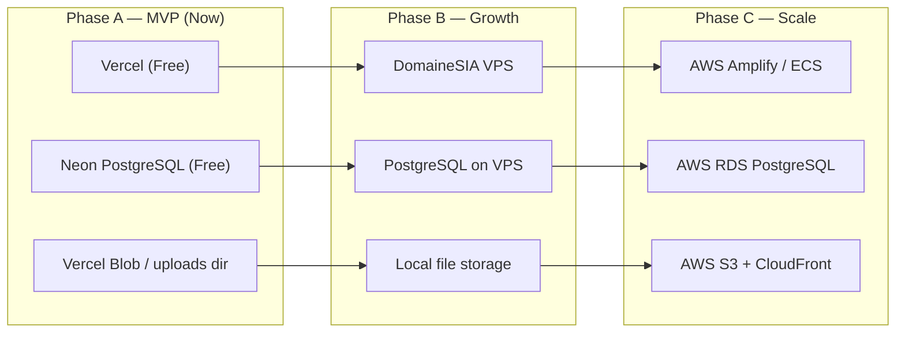
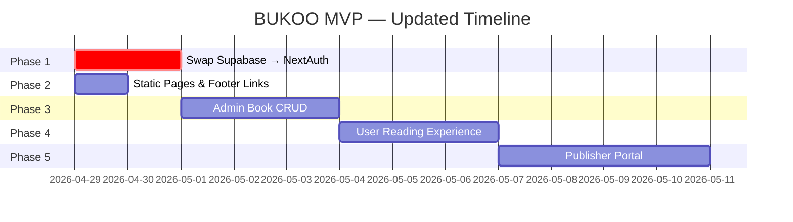

# BUKOO MVP Development Roadmap (v2)

> All open questions from v1 have been resolved. This version reflects the agreed decisions.

## Decisions Made

| Question | Decision |
|----------|----------|
| Social media links | "Coming soon" — no real accounts yet |
| Footer pages for MVP | Tentang BUKOO, Syarat & Ketentuan, Privasi, Pusat Bantuan (others = placeholder) |
| Publisher registration | Admin manually assigns PUBLISHER role |
| Infrastructure | **No Supabase** → self-hosted auth, DomaineSIA initially → AWS later |

---

## Infrastructure Recommendation 🏗️

Your current codebase has Supabase wired into **6 files**. Removing it is manageable. Here's what I recommend:

### Auth: Replace Supabase Auth → **NextAuth.js (Auth.js v5)**

| | Supabase Auth (current) | NextAuth.js v5 (recommended) |
|---|---|---|
| **Self-hosted** | ❌ Hosted by Supabase | ✅ Runs wherever your app runs |
| **Prisma integration** | Manual sync needed | ✅ Official Prisma adapter — users saved automatically |
| **Next.js integration** | Custom middleware | ✅ Built for Next.js (middleware, server components, route handlers) |
| **Credentials login** | ✅ | ✅ Email/password with bcrypt |
| **OAuth (Google, etc.)** | ✅ | ✅ 80+ providers, add later |
| **Cost** | Free tier limits | ✅ Always free, self-hosted |
| **DomaineSIA compatible** | ❌ Requires Supabase cloud | ✅ Works on any Node.js host |
| **AWS migration** | Need to swap auth provider | ✅ Same code, just deploy to EC2/Amplify |

> [!IMPORTANT]
> **NextAuth.js (Auth.js v5)** is the standard auth library for Next.js. It stores users directly in your Prisma/PostgreSQL database — no external auth service needed. This means your auth works on DomaineSIA, AWS, Vercel, or anywhere else.

### Hosting: Phased approach



#### Why start with Vercel + Neon (not DomaineSIA)?

| | Vercel + Neon | DomaineSIA VPS |
|---|---|---|
| **Cost** | Free tier (generous) | ~Rp 100K+/month |
| **Next.js support** | ✅ Built by the same team, zero config | ⚠️ Need to set up Node.js, nginx, PM2, SSL manually |
| **Deploy** | `git push` → auto-deploy | Manual SSH deploy or CI/CD setup |
| **HTTPS/SSL** | ✅ Automatic | Manual (Let's Encrypt) |
| **Scaling** | Auto | Manual |
| **MVP speed** | ✅ Deploy in minutes | Hours of server setup |

> [!TIP]
> **My recommendation: Use Vercel (free) + Neon PostgreSQL (free) for the MVP launch.** This gets you to market fastest with zero server management. When you need more control or have significant traffic, migrate to DomaineSIA VPS or directly to AWS. The code is identical — only the deployment target changes.

#### DomaineSIA is still useful for:
- **Domain name** — buy `bukoo.id` or similar from DomaineSIA
- **DNS management** — point your domain to Vercel
- **Future VPS** — when you need a dedicated server for background jobs, file processing, etc.

### File Storage (for book EPUBs + covers)

| Phase | Solution | Notes |
|---|---|---|
| MVP | **`/public/uploads/`** or Vercel Blob | Simple, works immediately |
| DomaineSIA | Local disk on VPS | Served by nginx |
| AWS | **S3 + CloudFront** | Scalable, CDN for fast delivery |

### Supabase Removal: Files to Change

Only **6 files** reference Supabase directly:

| File | Action |
|------|--------|
| `src/lib/supabase/client.ts` | DELETE |
| `src/lib/supabase/server.ts` | DELETE |
| `src/lib/supabase/supabase-middleware.ts` | DELETE → replace with NextAuth middleware |
| `src/app/(auth)/actions.ts` | REWRITE → use NextAuth `signIn()`/`signOut()` |
| `src/app/auth/callback/route.ts` | DELETE → NextAuth handles callbacks internally |
| `src/proxy.ts` | REWRITE → use NextAuth middleware |

Plus remove packages:
```bash
npm uninstall @supabase/ssr @supabase/supabase-js
npm install next-auth@beta @auth/prisma-adapter bcryptjs
npm install -D @types/bcryptjs
```

---

## Updated Phase 1: Auth with NextAuth.js 🔐
**Priority: 🔴 CRITICAL**
**Estimated effort: 2 days**

### 1a. Update Prisma schema for NextAuth + roles

NextAuth's Prisma adapter needs `Account`, `Session`, and `VerificationToken` models. We also add `PUBLISHER` role and a `password` field for credentials login:

```prisma
// prisma/schema.prisma

model User {
  id               String   @id @default(cuid())
  email            String   @unique
  emailVerified    DateTime?
  name             String?
  password         String?  // bcrypt hash for credentials login
  image            String?
  role             Role     @default(USER)
  subscriptionTier SubscriptionTier @default(FREE)
  subscriptionEndsAt DateTime?
  createdAt        DateTime @default(now())

  accounts         Account[]
  sessions         Session[]
  readingProgress  ReadingProgress[]
  transactions     Transaction[]
}

model Account {
  id                String  @id @default(cuid())
  userId            String
  type              String
  provider          String
  providerAccountId String
  refresh_token     String?
  access_token      String?
  expires_at        Int?
  token_type        String?
  scope             String?
  id_token          String?
  session_state     String?

  user User @relation(fields: [userId], references: [id], onDelete: Cascade)
  @@unique([provider, providerAccountId])
}

model Session {
  id           String   @id @default(cuid())
  sessionToken String   @unique
  userId       String
  expires      DateTime
  user         User     @relation(fields: [userId], references: [id], onDelete: Cascade)
}

model VerificationToken {
  identifier String
  token      String   @unique
  expires    DateTime
  @@unique([identifier, token])
}

enum Role { USER ADMIN CONTENT_MANAGER PUBLISHER }
```

### 1b. Create NextAuth configuration

```typescript
// src/lib/auth.ts
import NextAuth from "next-auth"
import Credentials from "next-auth/providers/credentials"
import { PrismaAdapter } from "@auth/prisma-adapter"
import { prisma } from "@/lib/prisma"
import bcrypt from "bcryptjs"

export const { handlers, signIn, signOut, auth } = NextAuth({
  adapter: PrismaAdapter(prisma),
  session: { strategy: "jwt" },
  providers: [
    Credentials({
      credentials: {
        email: {},
        password: {},
      },
      async authorize(credentials) {
        const user = await prisma.user.findUnique({
          where: { email: credentials.email as string }
        })
        if (!user?.password) return null

        const valid = await bcrypt.compare(
          credentials.password as string,
          user.password
        )
        if (!valid) return null

        return { id: user.id, email: user.email, name: user.name, role: user.role }
      },
    }),
  ],
  callbacks: {
    async jwt({ token, user }) {
      if (user) {
        token.role = (user as any).role
      }
      return token
    },
    async session({ session, token }) {
      if (session.user) {
        session.user.id = token.sub!
        session.user.role = token.role as string
      }
      return session
    },
  },
  pages: {
    signIn: "/login",
  },
})
```

### 1c. Create API route handler

```typescript
// src/app/api/auth/[...nextauth]/route.ts
import { handlers } from "@/lib/auth"
export const { GET, POST } = handlers
```

### 1d. Rewrite auth actions

```typescript
// src/app/(auth)/actions.ts
'use server'
import { signIn, signOut } from "@/lib/auth"
import { prisma } from "@/lib/prisma"
import bcrypt from "bcryptjs"
import { redirect } from "next/navigation"

export async function registerUser(formData: FormData) {
  const email = formData.get("email") as string
  const password = formData.get("password") as string
  const name = formData.get("name") as string

  const existing = await prisma.user.findUnique({ where: { email } })
  if (existing) {
    return redirect(`/register?error=${encodeURIComponent("Email sudah terdaftar.")}`)
  }

  const hash = await bcrypt.hash(password, 12)
  await prisma.user.create({
    data: { email, password: hash, name }
  })

  // Auto sign in after registration
  await signIn("credentials", { email, password, redirectTo: "/library" })
}

export async function loginUser(formData: FormData) {
  try {
    await signIn("credentials", {
      email: formData.get("email") as string,
      password: formData.get("password") as string,
      redirectTo: "/library",
    })
  } catch (error) {
    return redirect(`/login?error=${encodeURIComponent("Email atau password salah.")}`)
  }
}

export async function logoutUser() {
  await signOut({ redirectTo: "/" })
}
```

### 1e. Replace middleware

```typescript
// src/middleware.ts  (rename from proxy.ts)
import { auth } from "@/lib/auth"
import { NextResponse } from "next/server"

export default auth((req) => {
  const { pathname } = req.nextUrl
  const user = req.auth?.user

  // Protected routes: redirect to login if not authenticated
  if (pathname.startsWith("/library") || pathname.startsWith("/book")) {
    if (!user) {
      return NextResponse.redirect(new URL("/login", req.url))
    }
  }

  // Admin routes: require ADMIN role
  if (pathname.startsWith("/admin")) {
    if (!user) {
      return NextResponse.redirect(new URL("/login", req.url))
    }
    if ((user as any).role !== "ADMIN") {
      return NextResponse.redirect(new URL("/library", req.url))
    }
  }

  return NextResponse.next()
})

export const config = {
  matcher: ["/((?!api|_next/static|_next/image|favicon.ico|.*\\.(?:svg|png|jpg|jpeg|gif|webp)$).*)"],
}
```

### Files summary for Phase 1

| Action | File |
|--------|------|
| MODIFY | `prisma/schema.prisma` — add Account, Session, VerificationToken, password field, PUBLISHER role |
| CREATE | `src/lib/auth.ts` — NextAuth configuration |
| CREATE | `src/app/api/auth/[...nextauth]/route.ts` — API route handler |
| REWRITE | `src/app/(auth)/actions.ts` — use NextAuth + bcrypt |
| RENAME | `src/proxy.ts` → `src/middleware.ts` — use NextAuth middleware |
| DELETE | `src/lib/supabase/` — entire directory |
| DELETE | `src/app/auth/callback/route.ts` — no longer needed |
| MODIFY | `package.json` — swap supabase packages for next-auth + bcrypt |

---

## Phase 2: Static Pages & Footer Links 📄
**Priority: 🟠 HIGH — Can be done in parallel with Phase 1**
**Estimated effort: 1 day**

### Pages to create

| Page | Route | Content |
|------|-------|---------|
| ✅ Tentang BUKOO | `/tentang` | Company story, mission, vision |
| ✅ Syarat & Ketentuan | `/syarat-ketentuan` | Legal terms of service |
| ✅ Privasi | `/privasi` | Privacy policy |
| ✅ Pusat Bantuan | `/bantuan` | FAQ accordion with common questions |
| 🔜 Karir | `/karir` | "Segera hadir" placeholder |
| 🔜 Newsroom | — | "Segera hadir" placeholder |
| 🔜 Investor Relations | — | "Segera hadir" placeholder |
| 🔜 Blog | — | "Segera hadir" placeholder |

### Footer link mapping

Update [marketing/layout.tsx](file:///home/erachmat/Downloads/bukoo/src/app/(marketing)/layout.tsx):

```tsx
// Produk
<li><Link href="/koleksi">Koleksi Buku</Link></li>
<li><Link href="/originals">BUKOO Originals</Link></li>
<li><Link href="/komunitas">Komunitas</Link></li>
<li><Link href="/pricing">Harga & Paket</Link></li>

// Perusahaan
<li><Link href="/tentang">Tentang BUKOO</Link></li>
<li><Link href="/kontak">Kontak</Link></li>
// Others → keep href="#" with visual "Segera Hadir" indicator

// Untuk Penerbit
<li><Link href="/penerbit">Daftar Penerbit</Link></li>

// Bantuan
<li><Link href="/bantuan">Pusat Bantuan</Link></li>

// Legal (bottom)
<li><Link href="/syarat-ketentuan">Syarat & Ketentuan</Link></li>
<li><Link href="/privasi">Privasi</Link></li>
```

### Social media buttons

Replace emojis with proper SVG icons + "coming soon" tooltip:

```tsx
<div className="social-row">
  <a className="social-btn" title="Segera hadir">
    {/* Instagram SVG icon */}
  </a>
  <a className="social-btn" title="Segera hadir">
    {/* Twitter/X SVG icon */}
  </a>
  {/* ... */}
</div>
```

---

## Phase 3: Admin — Book CRUD & User Management 📚
**Priority: 🟡 MEDIUM**
**Estimated effort: 2–3 days**

_No changes from v1 — see original roadmap. The only difference is file uploads go to local `/public/uploads/` instead of Supabase Storage._

### Key files

| Action | File |
|--------|------|
| MODIFY | `src/app/admin/books/page.tsx` — real book table from Prisma |
| CREATE | `src/app/admin/books/new/page.tsx` — book creation form |
| CREATE | `src/app/admin/books/[id]/edit/page.tsx` — book edit form |
| CREATE | `src/app/admin/books/actions.ts` — server actions for CRUD |
| CREATE | `src/app/admin/users/page.tsx` — user management table (with role assignment for PUBLISHER) |
| MODIFY | `src/app/admin/page.tsx` — real stats from database |

### File upload example (local storage instead of Supabase)

```typescript
// src/app/admin/books/actions.ts
import { writeFile, mkdir } from 'fs/promises'
import path from 'path'

export async function createBook(formData: FormData) {
  const coverFile = formData.get('cover') as File
  const epubFile = formData.get('epub') as File

  // Save to public/uploads/
  const uploadsDir = path.join(process.cwd(), 'public', 'uploads')
  await mkdir(uploadsDir, { recursive: true })

  const coverPath = `/uploads/${Date.now()}-${coverFile.name}`
  await writeFile(
    path.join(process.cwd(), 'public', coverPath),
    Buffer.from(await coverFile.arrayBuffer())
  )

  const epubPath = `/uploads/${Date.now()}-${epubFile.name}`
  await writeFile(
    path.join(process.cwd(), 'public', epubPath),
    Buffer.from(await epubFile.arrayBuffer())
  )

  await prisma.book.create({
    data: {
      title: formData.get('title') as string,
      author: formData.get('author') as string,
      coverUrl: coverPath,
      fileUrl: epubPath,
      // ...
    }
  })
}
```

> [!NOTE]
> When migrating to AWS, replace local `writeFile` with S3 `putObject`. The database fields (`coverUrl`, `fileUrl`) stay the same — just the URL prefix changes.

---

## Phase 4: User Reading Experience 📖
**Priority: 🟡 MEDIUM**
**Estimated effort: 2–3 days**

_No changes from v1 — see original roadmap._

---

## Phase 5: Publisher Portal 🏢
**Priority: 🟢 LOWER**
**Estimated effort: 3–4 days**

### Updated flow (admin assigns role)

1. Publisher contacts BUKOO → Admin goes to `/admin/users` → changes role to `PUBLISHER`
2. Publisher logs in with same login page → middleware detects `PUBLISHER` role → redirects to `/publisher/dashboard`
3. No separate registration flow needed

### Key files

| Action | File |
|--------|------|
| CREATE | `src/app/(publisher)/layout.tsx` — publisher dashboard shell |
| CREATE | `src/app/(publisher)/dashboard/page.tsx` — revenue overview |
| CREATE | `src/app/(publisher)/books/page.tsx` — publisher's books |
| CREATE | `src/app/(publisher)/books/new/page.tsx` — submit new book |

---

## Execution Timeline



| Phase | Priority | Effort | Can Start |
|-------|----------|--------|-----------|
| 1. Auth (NextAuth) | 🔴 Critical | 2 days | Now |
| 2. Static Pages | 🟠 High | 1 day | Now (parallel with P1) |
| 3. Admin CRUD | 🟡 Medium | 2–3 days | After P1 |
| 4. Reading Experience | 🟡 Medium | 2–3 days | After P1 + P3 |
| 5. Publisher Portal | 🟢 Lower | 3–4 days | After P1 + P3 |

---

## All Decisions Finalized ✅

| Decision | Answer |
|----------|--------|
| Auth provider | NextAuth.js (Auth.js v5) + Prisma + bcrypt |
| MVP hosting | Vercel (free) + Neon PostgreSQL (free) |
| Domain | DomaineSIA — point DNS to Vercel |
| Migration path | DomaineSIA VPS or AWS when needed |
| Social media | "Coming soon" with proper SVG icons |
| Footer pages (MVP) | Tentang BUKOO, Syarat & Ketentuan, Privasi, Pusat Bantuan |
| Footer pages (later) | Karir, Newsroom, Investor Relations, Blog = placeholder |
| Publisher registration | Admin manually assigns PUBLISHER role |
| File storage (MVP) | Local `/public/uploads/` or Vercel Blob |

> [!TIP]
> This plan is ready for execution. When you want to start building, just say which phase to begin with — I'd recommend starting **Phase 1 (Auth) + Phase 2 (Static Pages) in parallel**.
