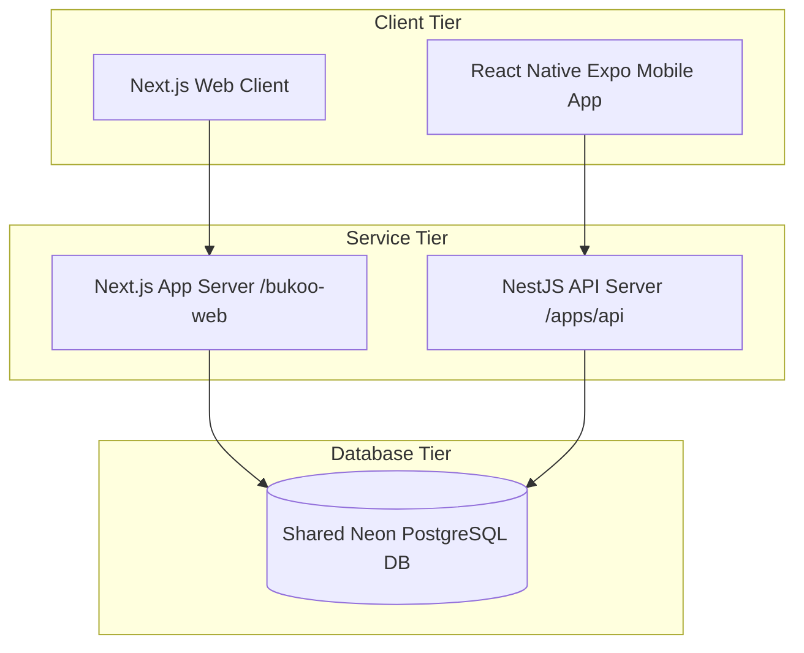

# BUKOO Web & Mobile App Integration Plan

This plan details the strategy for integrating the BUKOO Web application (`bukoo-web`) and the BUKOO Mobile application (`bukoo-mobile-app`) into a unified ecosystem. 

Integrating these projects will enable users to:
1. Use the same account credentials to log in on both the web platform and the mobile app.
2. Share subscription status (`FREE`, `BASIC`, `PREMIUM`) across all devices.
3. Automatically resume reading progress (`ReadingProgress`) seamlessly when switching between web and mobile.
4. Share saved books, shelves, and reading metrics (like daily goals or reading streaks).

---

## User Review Required

> [!IMPORTANT]
> **Database Consolidation:**
> Currently, the Web project uses **Neon PostgreSQL** and the Mobile API backend uses **Supabase PostgreSQL**. To integrate both projects, we must consolidate on a single database instance. We recommend using the **Neon PostgreSQL** database (defined in the root `.env`) as the single source of truth for both applications.

> [!WARNING]
> **Prisma Schema Breaking Changes:**
> The schemas for `User`, `Book`, and `ReadingProgress` have diverged. Merging these models will require running migration scripts to align column names (e.g., `password` in Web vs `passwordHash` in Mobile; `avatar` vs `avatarUrl`). We have defined a merged schema below to resolve these differences.

---

## Proposed Integration Architecture



---

## Proposed Changes & Steps

### 1. Database & Prisma Schema Unification
We will unify the database schemas for both projects. The mobile-only tables (like `LibraryShelf`, `ReadingGoal`, `ReadingStreak`) will remain but will link to the unified `User` and `Book` models.

#### [MODIFY] [schema.prisma](file:///home/erachmat/Downloads/bukoo/bukoo-web/prisma/schema.prisma) & [schema.prisma](file:///home/erachmat/Downloads/bukoo/bukoo-mobile-app/apps/api/prisma/schema.prisma)
We will merge the schemas into a single unified schema:

```prisma
// Unified schema.prisma

datasource db {
  provider = "postgresql"
  url      = env("DATABASE_URL")
}

generator client {
  provider = "prisma-client-js"
}

// --- Users ---
model User {
  id                  String            @id @default(cuid())
  email               String            @unique
  emailVerified       DateTime?
  name                String?
  password            String?           // Unified credentials password (bcrypt hash)
  avatarUrl           String?           // Merged avatar field
  role                Role              @default(USER)
  subscriptionTier    SubscriptionTier  @default(FREE)
  subscriptionEndsAt  DateTime?
  createdAt           DateTime          @default(now())
  updatedAt           DateTime          @updatedAt

  // NextAuth Relationships (Web-only)
  accounts            Account[]
  sessions            Session[]

  // Mobile-only Relationships
  refreshTokens       RefreshToken[]
  deviceTokens        DeviceToken[]
  readingGoal         ReadingGoal?
  streaks             ReadingStreak[]
  shelves             LibraryShelf[]

  // Shared Relationships
  readingProgress     ReadingProgress[]
}

// --- NextAuth Core Models ---
model Account {
  id                String  @id @default(cuid())
  userId            String
  type              String
  provider          String
  providerAccountId String
  refresh_token     String?
  access_token      String?
  expires_at        Int?
  token_type        String?
  scope             String?
  id_token          String?
  session_state     String?

  user User @relation(fields: [userId], references: [id], onDelete: Cascade)
  @@unique([provider, providerAccountId])
}

model Session {
  id           String   @id @default(cuid())
  sessionToken String   @unique
  userId       String
  expires      DateTime
  user         User     @relation(fields: [userId], references: [id], onDelete: Cascade)
}

// --- Books ---
model Book {
  id                   String            @id @default(cuid())
  title                String
  author               String
  publisher            String?
  description          String?           // Maps to Mobile's synopsis
  isbn                 String?           @unique
  coverUrl             String?
  fileUrl              String?           // Path to EPUB file
  fileType             FileType          @default(EPUB)
  genre                String[]
  tags                 String[]
  language             Language          @default(ID)
  year                 Int?              // Published year
  pageCount            Int?              // Maps to Mobile's totalPages
  readCount            Int               @default(0)
  isPublished          Boolean           @default(false)
  isPremium            Boolean           @default(true)
  createdAt            DateTime          @default(now())
  updatedAt            DateTime          @updatedAt

  // Shared Relationships
  readingProgress      ReadingProgress[]
  shelves              ShelfBook[]
}

// --- Reading Progress Syncing ---
model ReadingProgress {
  id                 String   @id @default(cuid())
  userId             String
  bookId             String
  progress           Float    @default(0)    // 0.0 to 1.0 (Used by Web)
  progressPercent    Float    @default(0)    // 0 to 100 (Used by Mobile)
  currentPage        Int      @default(0)    // Used by Mobile
  totalPages         Int      @default(0)    // Used by Mobile
  cfiPosition        String?                 // CFI location for EPUBs (Shared)
  readingTimeSeconds Int      @default(0)    // Accumulated time
  updatedAt          DateTime @updatedAt

  user User @relation(fields: [userId], references: [id], onDelete: Cascade)
  book Book @relation(fields: [bookId], references: [id], onDelete: Cascade)

  @@unique([userId, bookId])
}

// --- Mobile Features Models ---
model LibraryShelf {
  id        String      @id @default(cuid())
  userId    String
  name      String
  type      ShelfType   @default(CUSTOM)
  slug      String
  createdAt DateTime    @default(now())
  user      User        @relation(fields: [userId], references: [id], onDelete: Cascade)
  books     ShelfBook[]
}

model ShelfBook {
  shelfId String
  bookId  String
  addedAt DateTime     @default(now())
  shelf   LibraryShelf @relation(fields: [shelfId], references: [id], onDelete: Cascade)
  book    Book         @relation(fields: [bookId], references: [id], onDelete: Cascade)

  @@id([shelfId, bookId])
}

model RefreshToken {
  id        String    @id @default(cuid())
  token     String    @unique
  userId    String
  deviceId  String
  expiresAt DateTime
  revokedAt DateTime?
  user      User      @relation(fields: [userId], references: [id], onDelete: Cascade)
}

model DeviceToken {
  id        String         @id @default(cuid())
  userId    String
  token     String
  platform  DevicePlatform
  deviceId  String         @unique
  updatedAt DateTime       @updatedAt
  user      User           @relation(fields: [userId], references: [id], onDelete: Cascade)
}

model ReadingGoal {
  id               String   @id @default(cuid())
  userId           String   @unique
  dailyGoalMinutes Int      @default(5)
  user             User     @relation(fields: [userId], references: [id], onDelete: Cascade)
}

model ReadingStreak {
  id          String   @id @default(cuid())
  userId      String
  date        DateTime @db.Date
  minutesRead Int
  goalMet     Boolean  @default(false)
  user        User     @relation(fields: [userId], references: [id], onDelete: Cascade)
  
  @@unique([userId, date])
}

// --- Enums ---
enum Role { 
  USER 
  ADMIN 
  CONTENT_MANAGER 
  PUBLISHER 
}

enum SubscriptionTier { 
  FREE 
  BASIC 
  PREMIUM 
}

enum FileType { 
  EPUB 
  PDF 
}

enum Language { 
  ID 
  EN 
}

enum ShelfType {
  SYSTEM
  CUSTOM
}

enum DevicePlatform {
  ANDROID
  IOS
}
```

---

### 2. Authentication Flow Integration
* **Mobile Authentication Engine:** 
  The NestJS backend (`apps/api`) uses `@nestjs/jwt` and `@nestjs/passport` for login, registration, and refresh tokens. We will modify the auth services in NestJS to point to the shared Neon database and verify password hashes using the same credentials that NextAuth generates.
* **Credentials Mapping:**
  Ensure both backends use `bcrypt` / `bcryptjs` with compatible configurations (e.g., standard salt hashing rounds) to verify password compatibility.

---

### 3. Cross-Device Reading Progress Synchronization
* **Syncing Protocol:**
  - When a user reads on the **Web Client** (`bukoo-web`), the client periodically triggers a server action updating the `progress` (Float) and `cfiPosition` (string) on the `ReadingProgress` record.
  - When the user transitions to the **Mobile Client**, the mobile app pulls reading progress on reader startup.
  - The NestJS `ProgressController` returns the matching `cfiPosition` and `currentPage`.
  - The SQLite client offline sync module in the mobile client will push local increments via `PUT /reading/:bookId/progress` which resolves directly into updates on the same database table.

---

## Verification Plan

### Automated Tests
- Run `npx prisma db push` on Neon PostgreSQL to create the unified database structure.
- Run `npm run build` on both `bukoo-web` and `bukoo-mobile-app/apps/api` to verify TypeScript compile integrity.

### Manual Verification
1. **Register/Login Sync Test:**
   - Register a new user on the Web platform (`http://localhost:3000/register`).
   - Log in using those same credentials on the React Native mobile app.
2. **Reading Progress Sync Test:**
   - Open a book on the web app, read to chapter 3 (cfi location `epubcfi(/6/12...)`).
   - Open the same book on the mobile app, verify it starts reading automatically from the saved location in chapter 3.
   - Scroll forward on mobile, close the app.
   - Refresh the page on web, verify it resumes at the new page reached on mobile.
