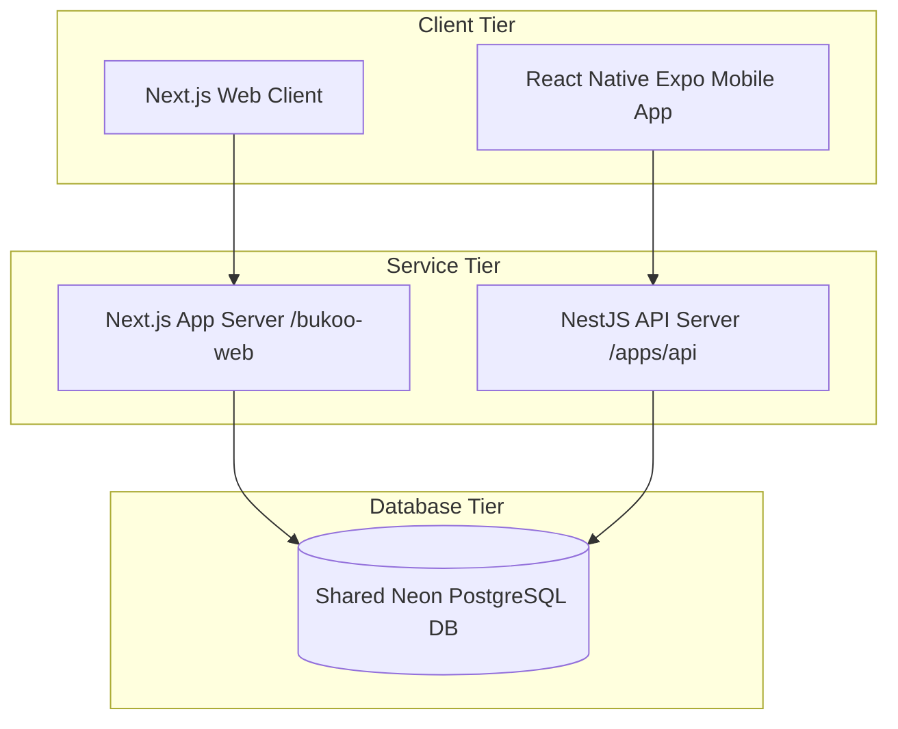

# BUKOO Web & Mobile App Integration Plan (Revised)

This plan details the strategy for integrating the BUKOO Web application (`bukoo-web`) and the BUKOO Mobile application (`bukoo-mobile-app`) into a unified ecosystem. 

Integrating these projects will enable users to:
1. Use the same account credentials to log in on both the web platform and the mobile app.
2. Share subscription status (`FREE`, `BASIC`, `PREMIUM`) across all devices using the full relational subscription models.
3. Automatically resume reading progress (`ReadingProgress`) seamlessly when switching between web and mobile.
4. Share saved books, shelves, and reading metrics (like daily goals or reading streaks).

---

## User Review Required

> [!IMPORTANT]
> **Database Consolidation:**
> Currently, the Web project uses **Neon PostgreSQL** and the Mobile API backend uses **Supabase PostgreSQL**. To integrate both projects, we must consolidate on a single database instance. We recommend using the **Neon PostgreSQL** database (defined in the root `.env`) as the single source of truth for both applications.

> [!WARNING]
> **Prisma Schema Migration Strategy:**
> - Do **NOT** use `prisma db push` on production.
> - Generate a migration with `npx prisma migrate dev --create-only`.
> - The output SQL file will be presented for manual review and approval before running `npx prisma migrate deploy`.

---

## Architectural Decisions & Standards

### 1. Single Auth Authority
- **Authority:** The **NextAuth (Auth.js) Database Schema** is the single authority of truth for credentials and user identity.
- **Deferral:** The NestJS API backend (`apps/api`) defers to this authority by:
  1. Direct database reading: NestJS queries the same unified `User` model.
  2. Same Password Hashing: NestJS validates credentials by reading the NextAuth-created bcrypt password hash directly from the shared user table.
  3. Session independence: While NextAuth issues cookie-based sessions for the Web browser, NestJS will continue to issue token-based JWTs (Access + Refresh) for the mobile app, both referencing the same shared `User.id`.

### 2. Renamed Column Mapping (`@map`)
To preserve existing data in both databases during the consolidation, we will use `@map` on the consolidated Prisma model. This prevents Prisma from dropping existing fields:
- `@map("passwordHash")` on the user credentials column to map the mobile-original database column to the Prisma `password` field.
- `@map("avatarUrl")` on the user avatar column to map the mobile-original database column to the Prisma `avatar` field.

### 3. Reading Progress Canonical Field
- We have **removed** the redundant `progress` (float 0-1) field.
- The canonical field is `progressPercent` (float 0-100).
- The web app client-side code will compute the `0-1` decimal representation dynamically during reading or rendering.

---

## Proposed Integration Architecture



---

## Proposed Changes & Steps

### 1. Unified Prisma Schema

#### [MODIFY] [schema.prisma](file:///home/erachmat/Downloads/bukoo/bukoo-web/prisma/schema.prisma) & [schema.prisma](file:///home/erachmat/Downloads/bukoo/bukoo-mobile-app/apps/api/prisma/schema.prisma)

```prisma
// Unified schema.prisma

datasource db {
  provider = "postgresql"
  url      = env("DATABASE_URL")
}

generator client {
  provider = "prisma-client-js"
}

// --- Users ---
model User {
  id                  String            @id @default(cuid())
  email               String            @unique
  emailVerified       DateTime?
  name                String?
  password            String?           @map("passwordHash") // Preserves existing mobile DB data
  avatar              String?           @map("avatarUrl")    // Preserves existing mobile DB data
  role                Role              @default(USER)
  createdAt           DateTime          @default(now())
  updatedAt           DateTime          @updatedAt

  // NextAuth Relationships (Web-only)
  accounts            Account[]
  sessions            Session[]

  // Mobile-only Relationships
  refreshTokens       RefreshToken[]
  deviceTokens        DeviceToken[]
  readingGoal         ReadingGoal?
  streaks             ReadingStreak[]
  shelves             LibraryShelf[]

  // Subscription Models (Restored from Mobile)
  subscription        Subscription?

  // Shared Relationships
  readingProgress     ReadingProgress[]
}

// --- NextAuth Core Models ---
model Account {
  id                String  @id @default(cuid())
  userId            String
  type              String
  provider          String
  providerAccountId String
  refresh_token     String?
  access_token      String?
  expires_at        Int?
  token_type        String?
  scope             String?
  id_token          String?
  session_state     String?

  user User @relation(fields: [userId], references: [id], onDelete: Cascade)
  @@unique([provider, providerAccountId])
}

model Session {
  id           String   @id @default(cuid())
  sessionToken String   @unique
  userId       String
  expires      DateTime
  user         User     @relation(fields: [userId], references: [id], onDelete: Cascade)
}

// --- Books ---
model Book {
  id                   String            @id @default(cuid())
  title                String
  author               String
  publisher            String?
  description          String?           // Combined with synopsis
  isbn                 String?           @unique
  coverUrl             String?
  fileUrl              String?           // Path to EPUB file
  fileType             FileType          @default(EPUB)
  genre                String[]
  tags                 String[]
  language             Language          @default(ID)
  year                 Int?              // Published year
  pageCount            Int?              // Maps to Mobile's totalPages
  readCount            Int               @default(0)
  isPublished          Boolean           @default(false)
  isPremium            Boolean           @default(true)
  createdAt            DateTime          @default(now())
  updatedAt            DateTime          @updatedAt

  // Shared Relationships
  readingProgress      ReadingProgress[]
  shelves              ShelfBook[]
}

// --- Reading Progress Syncing ---
model ReadingProgress {
  id                 String   @id @default(cuid())
  userId             String
  bookId             String
  progressPercent    Float    @default(0)    // 0 to 100 (Canonical field)
  currentPage        Int      @default(0)    // Used by Mobile
  totalPages         Int      @default(0)    // Used by Mobile
  cfiPosition        String?                 // CFI location for EPUBs (Shared)
  readingTimeSeconds Int      @default(0)    // Accumulated time
  updatedAt          DateTime @updatedAt

  user User @relation(fields: [userId], references: [id], onDelete: Cascade)
  book Book @relation(fields: [bookId], references: [id], onDelete: Cascade)

  @@unique([userId, bookId])
}

// --- Subscription Plan & Status (Restored from Mobile Schema) ---
model SubscriptionPlan {
  id            String         @id
  name          String
  priceMonthly  Float
  currency      String         @default("IDR")
  trialDays     Int            @default(7)
  features      String[]
  isPopular     Boolean
  isActive      Boolean
  subscriptions Subscription[]
}

model Subscription {
  id                     String             @id @default(cuid())
  userId                 String             @unique
  planId                 String
  status                 SubscriptionStatus
  trialEndsAt            DateTime?
  currentPeriodStart     DateTime
  currentPeriodEnd       DateTime
  cancelAtPeriodEnd      Boolean            @default(false)
  paymentGateway         PaymentGateway?
  externalSubscriptionId String?
  createdAt              DateTime           @default(now())
  updatedAt              DateTime           @updatedAt
  user                   User               @relation(fields: [userId], references: [id], onDelete: Cascade)
  plan                   SubscriptionPlan   @relation(fields: [planId], references: [id])
}

// --- Mobile Features Models ---
model LibraryShelf {
  id        String      @id @default(cuid())
  userId    String
  name      String
  type      ShelfType   @default(CUSTOM)
  slug      String
  createdAt DateTime    @default(now())
  user      User        @relation(fields: [userId], references: [id], onDelete: Cascade)
  books     ShelfBook[]
}

model ShelfBook {
  shelfId String
  bookId  String
  addedAt DateTime     @default(now())
  shelf   LibraryShelf @relation(fields: [shelfId], references: [id], onDelete: Cascade)
  book    Book         @relation(fields: [bookId], references: [id], onDelete: Cascade)

  @@id([shelfId, bookId])
}

model RefreshToken {
  id        String    @id @default(cuid())
  token     String    @unique
  userId    String
  deviceId  String
  expiresAt DateTime
  revokedAt DateTime?
  user      User      @relation(fields: [userId], references: [id], onDelete: Cascade)
}

model DeviceToken {
  id        String         @id @default(cuid())
  userId    String
  token     String
  platform  DevicePlatform
  deviceId  String         @unique
  updatedAt DateTime       @updatedAt
  user      User           @relation(fields: [userId], references: [id], onDelete: Cascade)
}

model ReadingGoal {
  id               String   @id @default(cuid())
  userId           String   @unique
  dailyGoalMinutes Int      @default(5)
  user             User     @relation(fields: [userId], references: [id], onDelete: Cascade)
}

model ReadingStreak {
  id          String   @id @default(cuid())
  userId      String
  date        DateTime @db.Date
  minutesRead Int
  goalMet     Boolean  @default(false)
  user        User     @relation(fields: [userId], references: [id], onDelete: Cascade)
  
  @@unique([userId, date])
}

// --- Enums ---
enum Role { 
  USER 
  ADMIN 
  CONTENT_MANAGER 
  PUBLISHER 
}

enum SubscriptionTier { 
  FREE 
  BASIC 
  PREMIUM 
}

enum SubscriptionStatus {
  TRIALING
  ACTIVE
  PAST_DUE
  CANCELED
  EXPIRED
  PENDING_PAYMENT
}

enum PaymentGateway {
  MIDTRANS
  XENDIT
}

enum FileType { 
  EPUB 
  PDF 
}

enum Language { 
  ID 
  EN 
}

enum ShelfType {
  SYSTEM
  CUSTOM
}

enum DevicePlatform {
  ANDROID
  IOS
}
```

---

### 2. ETL Migration Script
We will write a custom script `scripts/migrate-supabase-to-neon.ts` that will run before applying schema migrations. 

#### [NEW] [migrate-supabase-to-neon.ts](file:///home/erachmat/Downloads/bukoo/scripts/migrate-supabase-to-neon.ts)
The script will perform the following pipeline:
1. **Pre-requisite Validation:** Verify connectivity to both Neon DB and Supabase DB.
2. **Database Backup Dump:** Run a shell dump of both database instances before changing anything.
3. **Dry-Run Analysis:**
   - Detect user email collisions between Supabase and Neon.
   - Detect primary key conflicts.
   - Output detailed conflict report.
4. **Explicit Consent Prompt:** Halt and wait for user's explicit keyboard confirmation to write.
5. **Execution:** Sync all users, books, shelf items, streaks, and progress records from Supabase to Neon, mapping fields (like `passwordHash` to `password` and `avatarUrl` to `avatar`) appropriately.

---

### 3. Bcrypt Compatibility Test
Before relying on cross-platform verification, we will verify hash format compatibility between the systems.

#### [NEW] [test-bcrypt-compat.ts](file:///home/erachmat/Downloads/bukoo/scripts/test-bcrypt-compat.ts)
A test script that:
- Hashes a password string using `bcryptjs` (used in web).
- Validates the resulting hash using `bcrypt` (used in mobile/NestJS API).
- Hashes a password string using `bcrypt` and validates using `bcryptjs`.
- Verifies both libraries accept identical salt rounds and hash signatures.

---

## Verification Plan

### Automated Tests
- Run `npm run test:bcrypt-compat` to verify password hash library compatibility.
- Run `npm run migrate:dry-run` to output collision and backup reports.
- Generate migrations using `npx prisma migrate dev --create-only`.

### Manual Verification
1. **SQL Schema Code Review:** Inspect the generated migration sql file to confirm no `DROP COLUMN` commands are targeting `password` or `avatar`.
2. **Progress Sync Test:**
   - Log in on web and mobile with the same credentials.
   - Verify reading a book on web updates `progressPercent` directly in the Neon Database.
   - Verify mobile app retrieves `progressPercent` and resumes at the correct page.
