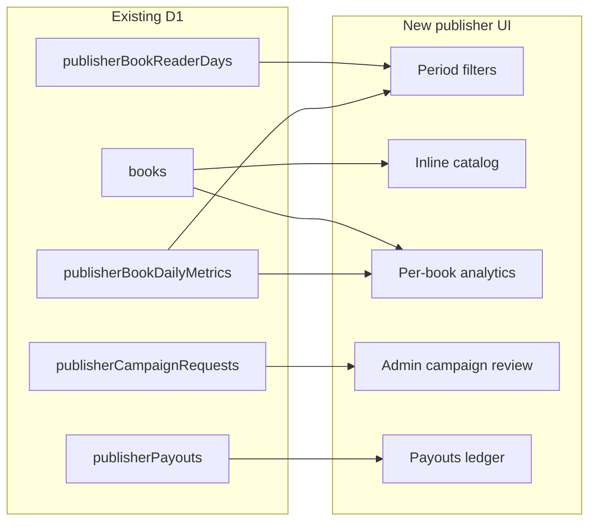

# Publisher Dashboard: Features, UX, and Performance

Uncommitted [publisher-dashboard-hardening](docs/superpowers/specs/2026-08-27-publisher-dashboard-hardening-design.md) work (scoped analytics, route guards, mobile nav, campaign validation, Vitest) is the base. **Keep it**; verify and land it as slice 0, then add features on top.

Hard constraint from the original MVP spec: **never fabricate revenue, age, gender, or city**. Users have no location/age fields today ([`packages/db/src/schema.ts`](packages/db/src/schema.ts) `users` has `favoriteGenres` only).

## Slice 0 — Land hardening (no new product scope)

Keep current diffs in [`apps/web/src/app/publisher/dashboard/queries.ts`](apps/web/src/app/publisher/dashboard/queries.ts), [`metrics.ts`](apps/web/src/app/publisher/dashboard/metrics.ts), middleware, shell, promotions, notifications. Complete remaining QA from [progress.md](.superpowers/sdd/publisher-dashboard-hardening/progress.md): typecheck/lint/test, then two-publisher isolation if credentials exist.

Performance leftover in the current query: distinct readers still load all matching `userId` rows then `Set.size`. Replace with SQL `count(distinct userId)` in the same slice or slice 1.

## Slice 1 — Period filters + query correctness

- Add a shared period helper (extend [`metrics.ts`](apps/web/src/app/publisher/dashboard/metrics.ts)): `this_month` | `last_month` | `all_time` (optional custom `from`/`to` as ISO dates). Inclusive `YYYY-MM-01` start, exclusive next-month bound.
- Drive dashboard via search params (`?period=this_month`) so filters survive refresh and are shareable. Default remains current calendar month.
- Scope **all** KPI aggregates (readers, seconds, completions, royalty estimate) to that period. Keep **top books** labeled: lifetime vs period (spec currently ranks lifetime; UI will show both or a toggle so labels cannot lie).
- Tests: month-start inclusion, last-month bounds, empty catalog, publisher isolation (extend [`metrics.test.ts`](apps/web/src/app/publisher/dashboard/metrics.test.ts)).

## Slice 2 — Inline catalog + per-book analytics

**Catalog:** Replace `PageKatalog` placeholder in [`dashboard-client.tsx`](apps/web/src/app/publisher/dashboard/dashboard-client.tsx) by rendering the real catalog inside `DashboardShell` (reuse list from [`books/page.tsx`](apps/web/src/app/publisher/(protected)/books/page.tsx): covers via `getCoverUrl`, status chips, edit/delete). Keep `/publisher/books` as the same view (shared component) so two URLs do not drift.

**Per-book analytics:** New route `/publisher/books/[id]/analytics` (publisher-owned only, `getPublisherUser()`). Query `publisherBookDailyMetrics` for the selected period: daily series (starts, seconds, completions) + unique readers from `publisherBookReaderDays`. Link from catalog rows and from overview top-books.

Replace the dashboard **Performa** tab with this list + drill-down instead of `PagePlaceholder`. **Pembaca** tab: retention buckets we can compute without PII (e.g. readers with 1 / 2–4 / 5+ reader-days in period). Still no age/gender.

UX: real cover thumbs on overview top-books (today uses emoji); period chips in the page head.

## Slice 3 — Admin campaign review

Table [`publisherCampaignRequests`](packages/db/src/schema.ts) already has `status`, `reviewerUserId`, `reviewNote`. Publisher create path in [`promotions/actions.ts`](apps/web/src/app/publisher/promotions/actions.ts) notes admin review as future work.

- Add `/admin/campaigns` (mirror [`/admin/submissions`](apps/web/src/app/admin/submissions/page.tsx)): list SUBMITTED/IN_REVIEW, approve / reject with note, notify publisher.
- Use `getAdminUser()`; never expose other publishers’ campaigns to a publisher.
- Link from [`admin-sidebar.tsx`](apps/web/src/app/admin/_components/admin-sidebar.tsx).
- Publisher promotions list already shows status; ensure it refreshes after admin action (`revalidatePath`).

No new migration unless we add an index on `(status, submittedAt)` after checking query shape.

## Slice 4 — Payouts ledger (records only, no bank execution)

Tables `publisherRoyaltyPeriods`, `publisherRoyaltyLines`, `publisherPayouts` exist and are empty. Xendit is still blocked on PT.

- Publisher **Royalti** page: period-scoped estimate (existing formula, `monthlyPool` still 0 → “Belum tersedia”) **plus** a payouts table from `publisherPayouts` (honest empty: “Belum ada settlement”).
- Admin: create/update a royalty period and record a payout row (amount, status, optional `externalRef`). This is a **manual ledger**, labeled as such — not a live transfer.
- Do not invent IDR amounts from reading data on this table; settlement amounts are admin-entered.

## Slice 5 — Demografi / geo (privacy-safe, not fake charts)

**Age / gender / city:** keep `PageUnavailable`. Collecting that requires new profile fields + consent on mobile/web; out of this pass.

**Country (optional, additive migration):** when recording reading metrics ([`packages/db/src/publisher-metrics.ts`](packages/db/src/publisher-metrics.ts) used by web + API), store **ISO country** from Cloudflare `CF-IPCountry` (or `XX` if missing) on a new aggregate table such as `(bookId, metricDate, countryCode)` with counts — **never store IP**. Publisher geo tab then shows country totals for owned books only. Empty until new reads arrive; historical rows stay unknown.

If you later reject country collection, the geo tab stays “data belum dikumpulkan” and slice 5 is skipped (no migration).

## UX / performance (woven into slices 1–2)

- URL tabs/period instead of only `useState` so back/refresh works.
- SQL aggregates (`count(distinct)`, `sum` grouped) instead of hydrating full metric/reader-day lists.
- Shared catalog table component; covers from R2 via `getCoverUrl`.
- Keep public [`showcase.tsx`](apps/web/src/app/publisher/dashboard/showcase.tsx) unchanged for logged-out visitors.

## Verification

Per `AGENTS.md`: `typecheck`, `lint`, and `test` for `apps/web`; if schema changes, `packages/db` typecheck + `drizzle-kit check` and inspect SQL (no FTS5 DELETE/UPDATE). Browser: dashboard period chips, catalog, one book analytics page, admin campaign approve/reject, royalty payouts empty state, responsive shell. Do **not** apply D1 migrations to production except via `migrate-d1.yml`.

